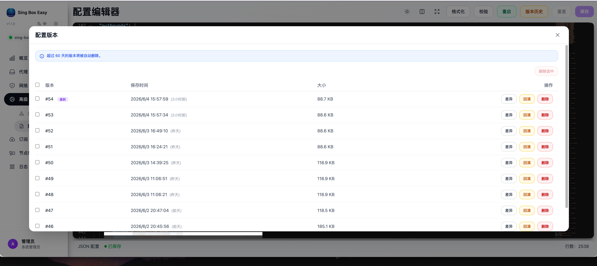
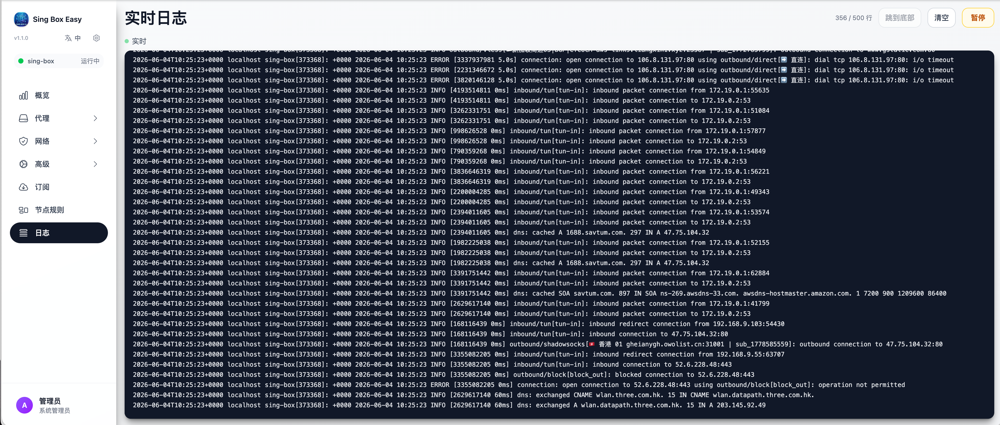

# sing-box-easy

sing-box-easy 是一个带有现代化 Web 界面的 sing-box 配置管理工具。它提供功能完整的仪表盘，用于可视化管理 sing-box 的配置、节点、订阅与服务生命周期。

## ✨ 主要特性

### 🖥️ Web 仪表盘
- **可视化配置管理**：内置 Monaco Editor，支持 JSON 语法高亮、补全与校验。 版本管理
[]
[]
- **节点与订阅**：直观的节点列表、分组（selector / urltest）编辑、订阅自动更新调度器。
[]
[]
- **初始化向导**：首次启动自动进入 `/init` 引导，分步完成 sing-box 安装、配置生成、Dashboard UI 部署。
- **实时监控**：查看 sing-box 进程状态与日志。
[]
- **现代化 UI**：Vue 3 + TypeScript + TailwindCSS v4 + DaisyUI + PrimeVue。

### ⚙️ 后端核心
- **RESTful API**：覆盖配置、DNS、Inbound/Outbound、路由、订阅、调度器、安装、Dashboard、初始化等共 79 个端点。
- **配置安全**：每次写盘都走 `写临时文件 → sing-box check → 原子替换 → 备份` 流程，可一键 `/config/rollback` 回滚。
- **引用一致性**：删除 outbound 或订阅刷新时自动清理 `selector` / `urltest` 中已失效的引用，避免 sing-box 静默运行时悬挂指针。
- **多协议解析**：Shadowsocks (`ss://`)、VMess (`vmess://`)、Trojan (`trojan://`)。
- **统一响应信封**：所有业务接口返回 `{ code, data, msg }`，HTTP 状态码恒为 200，前端按业务 `code` 分流。
- **订阅自动更新**：cron 调度器（默认每 5 分钟）按订阅配置的 `update_interval` 增量拉取、差分应用。
- **高性能存储**：SQLite + XORM（`modernc.org/sqlite` 纯 Go，无需 CGO）。

## 🚀 安装

请根据你的系统选择安装文档：

| 系统 | 安装方式 | 文档 |
| --- | --- | --- |
| **OpenWrt** / ImmortalWrt / LEDE | `opkg` 安装 `.ipk`，附带 LuCI 菜单入口 | **[openwrt_install.md](openwrt_install.md)** |
| **Debian / Ubuntu** 及衍生版 | 一键脚本 + systemd 服务 | **[debian_install.md](debian_install.md)** |

两份文档都包含：所需的前置条件、初始化向导在该系统上的推荐值、配置文件路径、默认端口与修改方法、服务的启停与重启、升级和卸载，以及常见问题排查。

> 两种方式都需要**先安装 sing-box 内核**，具体命令见对应文档。
>
> ⚠️ 如果路由器上已经装了 OpenClash / homeproxy / PassWall 等代理插件，**请先阅读 [OpenWrt 文档的第 0 节](openwrt_install.md#0-与其他代理插件共存)**：同一时间只能有一个插件接管流量，且不要把它们生成的 `config.json` 拿来做初始配置。

安装完成后，默认监听 **8080** 端口，浏览器访问 `http://<设备IP>:8080` 即可。
非 OpenWrt 系统上初始管理员账号密码为 `admin` / `admin`，**首次登录后请立即修改**。
