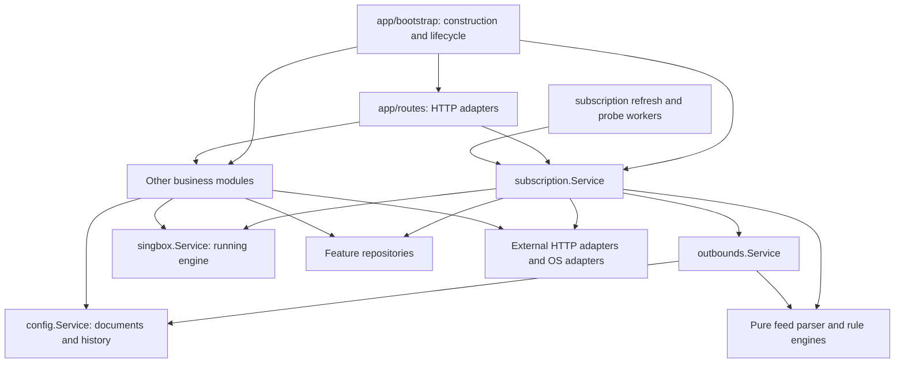

# Backend module architecture and migration plan

Status: implemented in the working tree, 2026-09-08. The implementation notes below describe the final structure; the original design and acceptance criteria follow for context.

## Implementation

- `app/bootstrap` constructs modules with a shared database engine, initializes persistence, resolves startup authentication policy, and owns worker startup/shutdown. Routes receive initialized feature dependencies.
- `subscription.Service` owns CRUD, refresh, import preview, probe operations/settings/history, and background lifecycle. `subscription/repo` persists subscription records, probe samples, and pending deletions. `subscription/model` contains shared values and ownership helpers.
- `subscription/internal/autoupdate` schedules refresh operations. `internal/probe` performs measurements and maintains snapshots. `internal/feed/fetch` owns HTTP/proxy/DoH/User-Agent behavior; `internal/feed/parser` parses bytes without networking or storage.
- `outbounds.Service` owns manual outbound edits and node-rule operations; its reconciler applies subscription changes and repairs group references under the config mutation lock. Rules live in `outbounds/rules`.
- `configuration.Service` owns DNS, routing, inbound, experimental, and raw document editing policies. The existing `config.Manager` remains the lossless document/validation/save engine; version storage and cleanup live in `config/history`. This preserves the existing document abstraction instead of adding a second document package.
- Runtime control moved from `pkg/service` to `pkg/singbox`. Diagnostic algorithms live under `diagnostics`; business operations resolve their dependencies. Traffic, installation, identity, settings, system information, and app-update operations own the policies extracted from their handlers.
- Shared runtime HTTP transport lives in `integrations/clashapi`; host operations live under `platform`. Existing GitHub adapters remain with their features because their semantics differ.
- HTTP handlers retain decoding, DTO mapping, authentication middleware, response/error encoding, uploads, and SSE framing. Architecture tests reject direct route dependencies on repositories, XORM, external adapters, platforms, and internal workers, and reject config mutation callbacks in routes.

Existing Go package identifiers were retained for several moved packages to limit unrelated identifier churn. Small persistence adapters in other features retain their existing file organization; they are constructed with explicit engines and are not exposed directly to HTTP. The proposed layout below is an ownership map, not an exact file manifest.

### Deletion and concurrency guarantees

Deletion durably marks the subscription pending, blocks/drains its probes, removes its owned nodes and group references, saves/applies config, and transactionally removes its subscription record, probe history, and pending marker. Failed operations retain pending state for retry. Startup attempts recovery before starting subscription workers; recovery failures are logged and remain retryable through the API.

The additive `subscription_pending_deletions` table is created through repository schema initialization. Existing subscription IDs, ownership suffixes, probe history, and HTTP URLs remain compatible.

Refresh, edit, and deletion serialize per subscription. This implements the planned stale-write protection by draining an active refresh before an edit/delete proceeds, rather than adding a revision column. Different subscriptions may fetch concurrently; reconciliation uses the fresh document under the shared config lock. Deletion cancels active probes and drains their publishers before deleting history. Refresh respects caller cancellation. Shutdown cancels and drains background workers before database close.

Config files, the runtime process, and SQLite still cannot commit atomically. A failed runtime restart or final database transaction can leave saved config with a pending subscription row; retry/startup recovery completes the operation. No full cross-resource rollback is promised.

Refreshing a feed also preserves another subscription's namespaced nodes when both feeds share a server. Settings forms validate all fields before an atomic write, then update live retention policy after commit.

### Verification

- Full `go test ./...` passed.
- Race-enabled subscription, scheduler, probe, feed, config-history, outbound-rule, and architecture tests passed.
- Focused regressions cover deletion recovery, config/restart/DB failures, history rollback, active refresh/probe coordination, shared-server ownership, partial edits/defaults, and whole-form settings validation.
- Existing document/reference compatibility and HTTP contract tests passed after extraction.
- `bun run build` passed; Vite reports large generated chunks.
- No live installation, engine restart, or browser workflow was exercised.

## Original design

## Diagnosis

The main problem is responsibility placement, not the number of packages. Business operations are split between HTTP handlers, workers, database managers, and clients. Moving directories alone would preserve that split.

Concrete examples:

| Current code | Responsibility currently exposed to transport |
| --- | --- |
| `app/routes/v1_12_12/handler.go`, `app/routes/nodes.go` | Construct repositories and clients, initialize schemas, choose configuration defaults, start workers |
| `subscription_handler.go` | Creation defaults, partial-update read/merge, URL normalization, probe-history cleanup after deletion |
| `subprobe_env.go` | Choose eligible subscriptions, resolve probe URLs, load configured ownership tags, construct a live Clash client, assemble probe settings |
| `subprobe_handler.go` | Choose history windows/buckets, combine store/runner/settings reads, validate and write multiple settings, trim history |
| `noderules_handler.go`, `outbound_handler.go` | Build node pools/groups, mutate outbounds, protect managed entries, maintain references |
| `dns_handler.go`, `route_handler.go` and raw helpers | Edit config documents, reorder rules, enforce references, perform cascading removal across DNS and routing |
| `settings_handler.go` | Coordinate persisted settings with live config-version retention |
| `routeprobe_handler.go`, `dnsprobe_handler.go`, `traffic_handler.go` | Resolve runtime dependencies, construct clients, choose diagnostic degradation or polling behavior |
| `user_handler.go` | Self-update permissions and self-deletion policy |
| `install_handler.go`, `init_handler.go` | Installation destination policy and interpretation of initialization state |

There are useful existing seams to preserve: config's section-preserving document operations, atomic validation/save, `service.Backend`, probe measurement interfaces, pure node-rule matching, and parser tests.

The preceding subscription fix is an intermediate state: `NewManager` returns `*AutoUpdater`, creates its own repository, and exposes persistence maintenance methods through `SubscriptionManager`. Probe history still belongs to the HTTP deletion path. The business module should instead own workers and expose complete operations.

## Target dependency direction



Arrows describe use, not a requirement to import every concrete implementation. Business modules declare small dependency interfaces where external I/O or independently testable behavior requires substitution. Bootstrap supplies concrete adapters. Pure helpers use ordinary function calls.

## Proposed layout

```text
app/
  bootstrap/                  # Build dependencies, migrate DB, start/stop workers
  routes/
    v1_12_12/                 # Existing URLs, DTOs, middleware, response/SSE encoding
  pkg/
    subscription/
      service.go              # Subscription operations; owns refresh/probe coordination
      commands.go             # Create/update/import inputs, results, errors
      refresh.go              # Fetch → parse → metadata → reconcile workflow
      lifecycle.go            # Admission, deletion and worker shutdown coordination
      model/                  # Subscription values, metadata, stable ownership helpers
      repo/                   # Subscription + probe history persistence, transactions
      internal/
        autoupdate/           # Scheduling, due selection, invokes refresh operations
        probe/                # Measurement, aggregation, snapshots, history policy
        feed/
          parser/             # Pure body/URI/base64/Clash/native-config parsing
          fetch/              # Subscription HTTP adapter; proxy/DoH/UA/metadata
    outbounds/
      service.go              # Manual node edits + imported-node reconciliation
      rules/                  # Existing noderules engine, templates, invariants
      repo/                   # Filter/group persistence
    config/
      service.go              # Document/section editing, validation, rollback/history
      dns.go                  # DNS edit and reference policies
      routing.go              # Route/rule-set edits and cascade policies
      inbounds.go             # Inbound edit policies
      document/               # Lossless document and section transformations
      repo/                   # Config-version persistence
    singbox/
      service.go              # Engine lifecycle, validation-before-start, host integration
      backend/                # systemd, procd, direct process adapters
    diagnostics/
      service.go              # Resolve dependencies and diagnostic execution policy
      dns/                    # Existing DNS probe algorithm
      route/                  # Existing route probe algorithm
      ruleset/                # Loading, decoding and matching used by diagnostics
    traffic/
      service.go              # Live sampling, filtering and aggregation
    installation/             # Core/dashboard installation + initialization workflow
    appupdate/                # Panel update workflow, separate from engine installation
    identity/                 # Existing user auth, sessions, permissions, preferences
      repo/
    githubauth/               # Device-flow orchestration and credential lifecycle
    settings/                 # General settings operations; persistence adapter underneath
      repo/
    integrations/
      clashapi/               # HTTP transport for runtime queries/delay/connections/DNS
      github/                 # Shared GitHub transport only where semantics actually match
    platform/
      openwrtnet/             # Host network integration, UCI execution
      process/               # Process operations
      sysinfo/               # Host inspection
    database/                 # Engine setup and migrations; no feature policies
    appconfig/                # Process startup configuration
    logger/                   # Logging foundation
    applog/                   # Panel log buffer/source
```

This is an ownership map, not a requirement to create every directory immediately. Keep closely related small operations in files until separate packages earn their cost. Do not add a generic `services`, `tools`, or `utils` dumping ground.

`subscription.Service` owns subscription probes and automatic refresh. The parser is also owned there initially: the current manual `/nodes/parse` operation can call `subscription.ImportPreview`, even without creating a subscription. If independent consumers later need pure parsing, promote only that parser; do not expose the whole feed-fetch workflow.

`outbounds` stays shared because manually entered nodes and node groups exist independently of subscriptions. `singbox` names the domain of today's `pkg/service`: its controller contains real lifecycle policy; only backend execution and HTTP clients are adapters.

## Subscription interface

Expose user or job operations rather than database setters. An indicative surface:

```go
Create(ctx, CreateCommand) (Subscription, error)
Update(ctx, id, UpdateCommand) (Subscription, error)
Delete(ctx, id) (DeleteResult, error)
Get(ctx, id) (Subscription, error)
List(ctx, query) (Page, error)
Refresh(ctx, id) (RefreshResult, error)
ImportPreview(ctx, ImportCommand) (ImportResult, error)
Probe(ctx, id) (ProbeResult, error)
ProbeHistory(ctx, id, HistoryQuery) (History, error)
ProbeOverview(ctx) (ProbeOverview, error)
UpdateProbeSettings(ctx, ProbeSettingsCommand) (ProbeSettings, error)
```

These signatures are illustrative; preserve the current list shape initially rather than introducing pagination as part of this migration. Read-only probe/query method sets may be separate consumer interfaces backed by the same module. Workers receive only the methods they need. `Init`, `UpdateInfo`, `UpdateLastUpdate`, and `UpdateOfficialURL` are internal persistence concerns, not the route-facing contract.

Construct the module from explicit dependencies. Repositories accept `*xorm.Engine`; they do not obtain a global database or call `logger.Fatal`. Bootstrap initializes schemas and returns errors to the executable.

Preserve field presence with pointers or optional command fields. HTTP decoding determines whether a field was supplied; business logic decides defaults, validates URLs, merges edits, generates IDs, and returns the created record. This also fixes the current shape where the store generates an ID on a by-value input but the handler returns its original ID.

## Separate parsing, fetching and application

The current `SubLink.ListNodes` accepts URL strings and proxy URIs, performs network I/O, and parses results. Replace this implicit behavior internally with explicit operations:

```text
fetch.Fetch(ctx, URL, FetchOptions) → Feed{Body, Headers, FinalURL}
parser.Parse(Body)                 → ParsedNodes
subscription.ImportPreview(input) → fetch where requested + parse + result
subscription.Refresh(id)          → load settings + fetch + parse + reconcile + apply
```

The parser never accesses HTTP, DNS, storage, timers, or the running engine. Fetching owns transport-specific proxy, DoH, User-Agent negotiation and response limits. Subscription business logic owns configured fetch preferences and interpretation of provider metadata. Cancellation flows from the caller into HTTP and subsequent operations.

Clash API clients likewise return measurements or transport errors. Probe policy decides what counts as unavailable, untestable, or an invalid measurement, and whether to persist it. Diagnostics and traffic reuse the client without importing subscription.

## State consistency and deletion

Relocation must fix the complete lifecycle, including races with probing:

1. Admit deletion through subscription's per-subscription lifecycle gate. Mark deletion pending durably before external effects when crash recovery is implemented. Stop admission of new refresh/probe work for this subscription.
2. Cancel or drain active work for that subscription. Do not hold a global config lock during HTTP fetches or latency measurements.
3. Reconcile removal through `outbounds` against the fresh document under config's mutation lock. Remove owned nodes and references, rebuild managed groups, validate, and save. Ownership uses the existing suffix rule; unowned legacy/manual nodes are not guessed from their host.
4. Apply the saved configuration using the engine lifecycle module. Record whether persistence and application succeeded separately.
5. In one SQLite transaction, delete the subscription and its probe history. Clear in-memory probe snapshots and refresh statistics after outstanding publishers are drained.
6. On failure, retain a recoverable pending operation; retries resume idempotently. On startup, recover pending deletion before starting workers. Surface the failed phase as a typed result/error.

SQLite, a config file and a running process cannot share a transaction. Do not promise rollback of all three. The current retain-row-on-restart-failure behavior is a useful first step, but lacks durable pending state and probe coordination. Introduce that state with a migration and failure tests in its own change.

For refresh, fetch outside the config lock, then recheck subscription existence/revision before committing. A refresh fetched using an old URL must not overwrite an edit or recreate a deleted subscription's nodes. Scheduled refresh can batch engine application, preserving today's one-restart-per-sweep behavior; the scheduler only triggers the business operation that owns batching.

All config-changing operations share config's serialized mutation mechanism. Keep runtime application serialized too, and define one lock order. Preserve unknown DNS/route fields and existing raw-document compatibility. Preserve each endpoint's current save/apply behavior during extraction; do not silently make every config edit restart the engine.

## What remains in routes

Routes decode path/query/body/multipart inputs, extract the authenticated principal, call a business operation, map typed errors, and encode responses. They retain HTTP authentication middleware, route registration, body limits, SSE framing/heartbeats, and request cancellation.

They do not load repositories, construct clients, mutate config via callbacks, apply defaults, read an entity to merge an update, trim history, choose fallback diagnostics, or start workers. Resource authorization (such as self-update/self-deletion constraints) belongs in the identity operation and receives the principal explicitly; middleware still handles transport authentication and coarse route access.

Syntactic parsing remains in transport; semantic validation remains in the feature. DTO mapping is allowed, including mapping domain results into the existing response envelopes. Domain errors must not expose Hertz codes, raw SQL errors or external-client-specific types. Translate external failures into feature errors before transport sees them.

Streaming business operations yield typed events under context cancellation. HTTP handles SSE encoding and disconnects. Upload transport passes a stream/file abstraction to installation; installation owns task input lifetime and cleanup.

## Migration sequence and acceptance criteria

1. **Extract bootstrap and lifecycle.** Move construction, initialization, auth-mode resolution and worker startup out of handlers. Inject feature dependencies into grouped handlers. Verify startup failure unwinds initialized resources and shutdown drains work before database close. Preserve routes and response envelopes.
2. **Finish the subscription module.** Make `Service` the owner; place autoupdate and probe underneath it. Move probe environment, history policy, defaults, metadata and history cleanup out of routes. Move ownership helpers into a leaf model package so probe never imports its parent service and creates a cycle. Move repository maintenance methods off the public interface.
3. **Separate feed fetching and parsing.** Preserve parser fixtures and fetch fallback tests. Test pure parsing without a network, HTTP adapters with local servers, and subscription operations with injected fetch/probe dependencies. Preserve `/nodes/parse` behavior through an import-preview operation.
4. **Complete deletion coordination.** Add pending state/recovery, transactional record/history removal, snapshot cleanup, and refresh revision checks. Test delete versus active probe/refresh, edits during fetch, config failure, restart failure, DB failure after config application, and process restart during deletion. Keep identity/tag migration separate from this change.
5. **Extract outbounds and config operations.** Move managed-node protection, group rebuilding, DNS/inbound validation, route reordering and rule-set cascades from handlers. Move version storage/cleanup under config. Keep document compatibility tests and add operation tests across references and managed groups.
6. **Extract remaining workflows.** Move diagnostics/client resolution, traffic sampling, feature settings effects, identity resource permissions, installation and initialization policy. Rename existing runtime `service` to `singbox`; move its backend adapters and shared external clients without rewriting their proven algorithms. Keep app self-update separate from sing-box installation.
7. **Enforce the seam.** Remove compatibility constructors and old imports after callers migrate. Add an import check: routes cannot depend on repositories, XORM, external-client adapters or worker implementations; business packages cannot import routes/Hertz; parsers cannot import network/storage packages. Review routes for residual orchestration because import checks alone cannot detect it.

Each stage should be a reviewable change with behavior tests at the feature interface, focused adapter tests, and a small set of HTTP contract tests. Move existing policy tests with their implementation rather than duplicating them in both layers. Run `go test ./...` for each backend stage; use race tests for worker/lifecycle changes. Use `bun run build` and affected UI checks when frontend contracts or behavior change.

Completion means deleting a subscription through HTTP, a scheduled operation or a direct Go caller follows the same lifecycle; a feature's behavior can be tested without Hertz; routes only know feature operations and transport concerns; and database/client/worker implementations can change without route edits.
